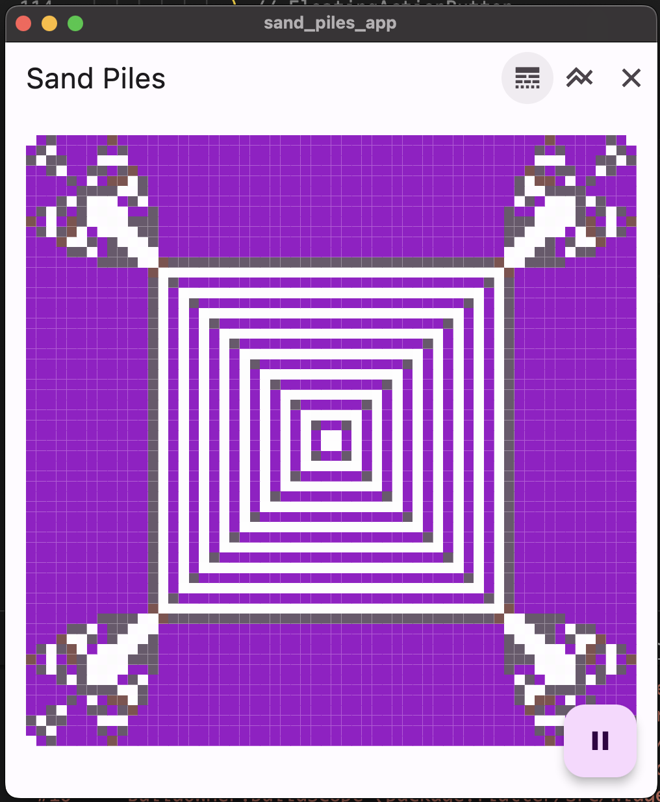

# Sand piles app

An exmaple of using the [sand_piles](https://github.com/billy1380/sand_piles) package.

## Getting started

Clone the following repos:

- [sand_piles](https://github.com/billy1380/sand_piles)
- [main_thread_processor](https://github.com/billy1380/main_thread_processor)
- [willshex-dart](https://github.com/billy1380/willshex-dart)

and have a play.

